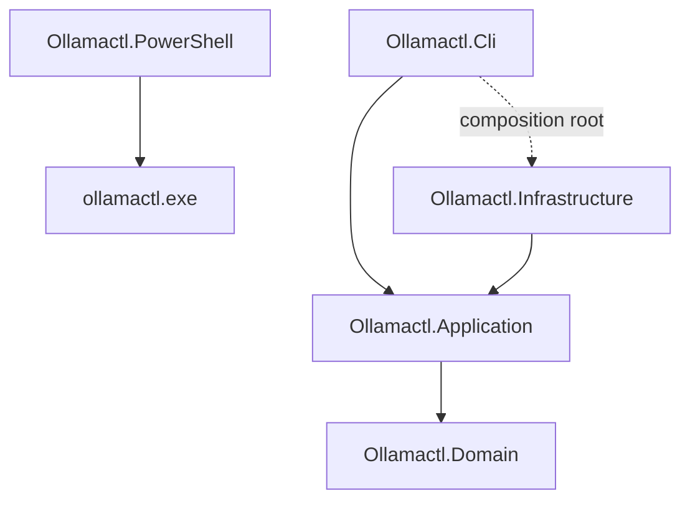

# Architecture

This document describes the version 0.3.0 architecture of `ollamactl`. The
design follows Clean Architecture: policy points inward, operating-system and
network details remain adapters, and the executable composes the graph at the
edge.

## Goals

- Provide a stable wrapper over both the Ollama REST API and `ollama.exe`.
- Keep domain and application policy independent from CLI, HTTP, JSON, process,
  and filesystem implementations.
- Support deterministic text/JSON output and stable exit codes.
- Manage only processes whose identity `ollamactl` can prove.
- Keep secrets out of diagnostic output and process-state files.
- Make unit, integration, architecture, and end-to-end tests deterministic.

## Dependency direction



The essential rule is:

```text
Domain <- Application <- Infrastructure / CLI
```

`Ollamactl.Cli` may reference Infrastructure only at the composition root to
select concrete adapters. Command handlers interact with application ports and
use cases, not concrete HTTP or process implementations. Domain never
references Application, Infrastructure, CLI, or PowerShell.

Architecture tests under `tests/Ollamactl.ArchitectureTests` enforce the
project-reference direction.

## Layers

### Ollamactl.Domain

The innermost project contains stable business concepts and values:

- installed and running models;
- chat and tool-probe results;
- aggregate API status.

Domain types have no console, HTTP, filesystem, process, or JSON concerns.

### Ollamactl.Application

Application coordinates use cases and defines ports required from the outside:

- Ollama API client and factory abstractions;
- native Ollama command execution abstraction;
- server/process manager abstraction;
- path, configuration, process, lifecycle, log, and health models;
- dotenv parsing and configuration precedence;
- services that combine domain operations.

Application can depend on Domain and the .NET base class library. It must not
depend on Infrastructure or CLI presentation types.

### Ollamactl.Infrastructure

Infrastructure implements Application ports with external mechanisms:

- HTTP calls to the official Ollama REST API;
- safe native process execution using argument lists (with an explicit
  `cmd.exe` compatibility path only when a `.cmd` or `.bat` shim is selected);
- background server supervision;
- process discovery and identity validation;
- atomic state persistence;
- filesystem paths, dotenv loading, and managed log streams;
- source-generated JSON contracts.

Infrastructure translates mechanism failures into application-facing results or
exceptions without choosing CLI exit codes or formatting console output.

### Ollamactl.Cli

CLI is the presentation layer and executable composition root. It owns:

- the `System.CommandLine` command tree;
- argument and option validation;
- text and JSON rendering;
- stdout/stderr separation;
- cancellation and exception-to-exit-code mapping;
- construction of application services and infrastructure adapters.

Handlers remain thin: parse, call a use case, render, and return an exit code.

### Ollamactl.PowerShell

The PowerShell module is outside the internal .NET graph. It locates and invokes
`ollamactl.exe`; structured functions always request `--output json` and convert
the result to PowerShell objects. It does not implement a second HTTP client,
dotenv parser, or process manager.

## Execution paths

### REST path

```text
CLI command -> Application service -> IOllamaApiClient -> HTTP adapter -> Ollama API
```

Used for API health, installed/running models, model load/unload, chat, and tool
probing. This path supports remote endpoints and has no dependency on local
process discovery.

### Native passthrough path

```text
ollamactl ollama -- <args> -> native runner -> ollama.exe <args>
```

For `ollama.exe`, arguments remain distinct tokens and no shell evaluates them.
Windows batch shims require the platform command interpreter and a fully quoted
payload; executable discovery prefers the real `.exe`. Stdout, stderr, and the
upstream exit code remain observable. This path gives immediate coverage for
new official CLI features.

### Local orchestration path

```text
server/process command -> Application port -> process adapter -> OS/filesystem
```

Used for managed background lifecycle, process ownership, state, and logs.
Process operations are local even when `--host` points to a remote server.

### Diagnostic path

`health` / `doctor` combines local configuration and process checks with API
reachability and model information. Log content is opt-in and bounded. See
[Health checks](health-check.md).

## Configuration boundary

Configuration resolution happens once near the CLI boundary and produces a
validated application model. Precedence is command line, process environment,
dotenv file, then defaults. Paths are normalized before infrastructure writes
state or logs.

The dotenv file is data, not executable code. Keys and values are parsed and
passed directly to a child process. Diagnostic commands expose sources and
redacted metadata, not arbitrary values. See [Configuration](configuration.md).

## Process ownership and safety

A managed server has durable state under its selected configuration directory.
State identifies the supervisor and target executable, process IDs, and start
identity needed to defend against PID reuse. State is written atomically.

Before stopping anything, Infrastructure compares saved identity with live
process identity. Missing, corrupt, exited, or mismatched state becomes
`not-managed`, `exited`, or `stale`; it is not permission to kill a process by
name. See [Process management](process-management.md).

## Output and error contract

- Successful results are written to stdout.
- Diagnostics and errors are written to stderr.
- `--output text` is optimized for people.
- `--output json` is deterministic and intended for automation.
- Cancellation is propagated through application and infrastructure APIs.
- Network operations have bounded timeouts.
- Stable CLI exit codes distinguish usage, failure, unavailability, and
  cancellation.

Native passthrough is the exception to wrapper-specific error translation: it
preserves the delegated program's exit code.

## Test architecture

| Suite | Boundary exercised |
|---|---|
| Unit | Domain/application policy, parsing, handlers, rendering |
| Architecture | Project dependencies and layer rules |
| Integration | Real loopback HTTP, JSON contracts, process/state adapters |
| End-to-end | Published CLI process, stdout/stderr/JSON/exit codes |
| Pester | PowerShell module composition, argument mapping, safe invocation |

The fake Ollama API uses loopback sockets and deterministic responses. Default
tests do not require a local model, GPU, or running user daemon. A real-model
smoke test is intentionally manual because model inventory and hardware are
environment-specific.

## Publishing

The default Windows artifact is self-contained, trimmed, compressed, and
single-file. Native AOT is an optional publish mode. Publishing occurs in a
staging directory; the exact staged executable must pass end-to-end tests before
promotion. The final package includes SHA-256 and machine-readable artifact
metadata. See [Release process](release.md).

## Related documentation

- [CLI reference](cli-reference.md)
- [Wrapper routing](wrapper-routing.md)
- [Process management](process-management.md)
- [Health checks](health-check.md)
- [Development](development.md)
